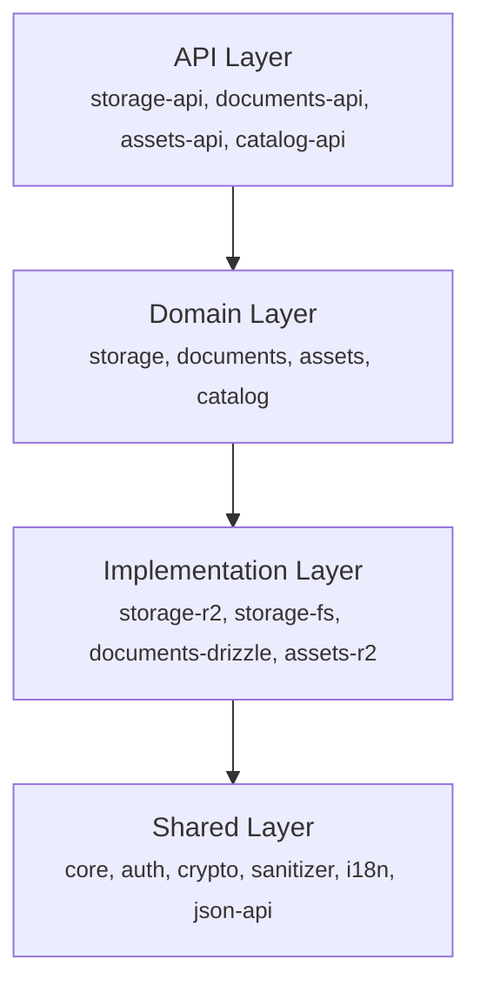
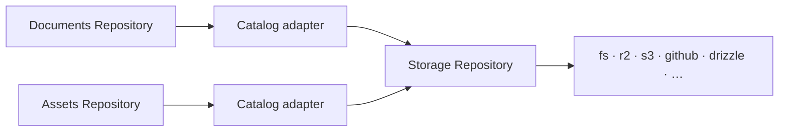

# Architecture

## Why it is layered

Making an agnostic, headless content system that is useful turned out to be more difficult than it
first appeared 🫠. Trial and error led to thinking in layers. Domain-driven design helped, which is
why there is a lot of DDD-lite across the codebase. The continuing struggle between usefulness and
complexity produced the layered architecture described here.

At the core is a storage object: content that is uniquely addressable through a key — comparable to
an AWS S3 object. An object can be a database record, a page, a select-input choice, or a sensor
metric. LaikaCMS supplies the address and transport contracts; the application owns the content
shape.

Each layer adds assumptions on top of that foundation:

1. **Core storage** — objects, folders, keys, and arbitrary content.
2. **Documents and assets** — content with document or binary-asset behavior.
3. **Repository contracts** — abstract interfaces and the protocol for accessing those resources.
4. **Concrete repository implementations** — filesystem, R2, proxy, and composed repositories.
5. **Catalog settings and providers** — configuration for repository behavior; providers can be
   chained, and when settings live in content a provider can query the repository for them.
6. **Contract consumers** — APIs, the Decap CMS admin, and other applications built on the
   contracts.

This is a union model: each layer adds assumptions the farther it gets from the core. The document
contract, for example, assumes a document has a status and language. Applications without those
concepts expose a constant `published` status; language defaults to `und`, the valid BCP 47 tag for
undetermined language.

## Layers



- **Domain packages** define interfaces, not implementations
- **Implementation packages** depend on domain packages
- **API packages** depend on domain packages (not implementations)
- **Shared packages** have no internal dependencies

## The repository pattern

Every protocol is accessed through a **repository**: the domain defines the abstract class, and each
[backend](../backends/fs) provides a concrete implementation.

```typescript
// Domain defines the interface
abstract class StorageRepository {
  abstract getObject(key: Key): LaikaTask.LaikaTask<StorageObject>;
  abstract createObject(create: StorageObjectCreate): LaikaTask.LaikaTask<StorageObject>;
  abstract listAtoms(
    folderKey: Key,
    options: ListAtomsOptions,
  ): LaikaStream.LaikaStream<Atom, ListAtomsDone>;
}

// An implementation provides concrete behavior against real infrastructure
class R2StorageRepository extends StorageRepository {
  /* … talks to a Cloudflare R2 bucket … */
}
```

Common data sources have implementations you can pick and compose like a banquet. Use one, extend
one for your infrastructure, or implement a contract directly. The goal is to get you 90% there; the
last part is usually a small extension to fit your infrastructure.

Two composition patterns recur everywhere:

- **Routing repository** — fronts several repositories and routes each request by key prefix.
  Multi-backend setups (some collections in git, some in a database), fallback chains, and
  environment-specific storage (browser storage in dev, cloud in production) are all this one
  pattern.
- **Storage adapter** — the Catalog layer (`CatalogDocumentsRepository`, `CatalogAssetsRepository`)
  implements the document and asset contracts _on top of_ any storage repository, so documents and
  assets can live in every storage backend without backend-specific code.



## Tasks and streams

Repository methods return either `LaikaTask<T>` (single result) or `LaikaStream<T, D>` (multiple
results with a typed done value). Both are Effect-based; use the `laikacms/compat` helpers to
consume them without importing Effect directly:

```typescript
import { collectStream, runTask } from 'laikacms/compat';

// Single result
const object = await runTask(repo.getObject('posts/hello'));

// Stream of results
const { items, done } = await collectStream(
  repo.listAtoms('posts/', { depth: 1, pagination: { offset: 0, limit: 100 } }),
);
```

## Standard Schema

LaikaCMS exports its entity types as
[Standard Schema v1](https://github.com/standard-schema/standard-schema) compatible schemas, usable
with Zod, Valibot, ArkType, or any Standard-Schema-compatible validator.

```typescript
import { StorageObjectSchema } from 'laikacms/storage';

const result = StorageObjectSchema['~standard'].validate(unknownPayload);
```

Content validation is the caller's responsibility: `createObject` accepts your content object as-is
and does not run schema validation on it — validate with your own schema first.

## Going deeper

- The four protocols in detail: [Storage](./storage), [Documents](./documents), [Assets](./assets),
  [Catalog](./catalog)
- [Transports](./transports) — the contracts over HTTP
- [Glossary](../reference/glossary) — the load-bearing definitions (atom, version, sync token,
  change feed)
