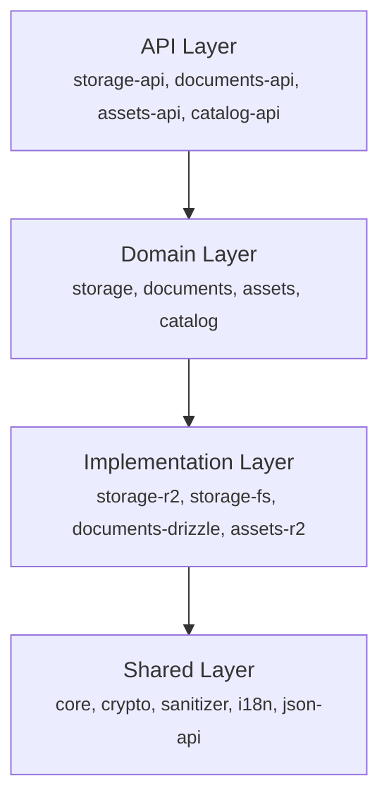

# Architecture

## Why it is layered

Making an agnostic, headless content system that is useful turned out to be more difficult than it
first appeared 🫠. Trial and error led to thinking in layers. Domain-driven design helped, which is
why there is a lot of DDD-lite across the codebase. The continuing struggle between usefulness and
complexity produced the layered architecture described here.

The amount of terminology can make the original goal of simplicity sound counterintuitive. It
becomes natural once you work with content this way, and the jargon quickly disappears into the
background. Most CMSs contain these concepts too. They hide the complexity by tightly coupling
concepts that do not need to be coupled, in the name of convenience.

Laika CMS is layered so applications can adopt only the assumptions they need. At the core is a
[storage object](./content-model.md#atoms-and-folders): content that is uniquely addressable through
a key. It is comparable to an AWS S3 object: a generic thing that is uniquely addressable. An object
can be each of the choices `red`, `green`, and `blue` in a select input (even when they have no
value), a database record, a page, or a sensor metric. Laika CMS supplies the address and transport
contracts. The application owns the content shape.

Each conceptual layer adds assumptions on top of that foundation:

1. **Core storage** — objects, folders, keys, and arbitrary content.
2. **Documents and assets** — content with document or binary-asset behavior.
3. **Repository contracts** — abstract interfaces and the protocol for accessing those resources.
4. **Concrete repository implementations** — filesystem, R2, proxy, and composed repositories.
5. **Repository settings** — configuration for repository behavior.
6. **Settings providers** — providers can be chained. When settings live in content, a provider can
   receive a repository and query it to return those settings.
7. **Contract consumers** — APIs, admin interfaces, the custom Decap CMS fork, and other
   applications built on the contracts.

This is a union model: each layer adds assumptions the farther it gets from the core. The built-in
document contract, for example, assumes a document has a status and language. Applications that do
not use those concepts can expose a constant `published` status; language defaults to `und`, the
valid BCP 47 tag for undetermined language.

Common data sources have implementations you can pick and compose like a banquet. You can use one,
extend one for your infrastructure, or implement a contract directly. The reason to use Laika CMS is
that you don't want to model your domain around your CMS. The goal is to get you 90% there; you will
most likely implement or extend a repository to make the last part fit your infrastructure. See
[Repositories](./repositories.md) for composition and implementation guidance and
[Packages](../reference/packages.md) for the available implementations and exports.

## Layers



## Principles

- **Domain packages** define interfaces, not implementations
- **Implementation packages** depend on domain packages
- **API packages** depend on domain packages (not implementations)
- **Shared packages** have no internal dependencies

## Patterns

### Repository Pattern

```typescript
// Domain defines the interface
abstract class StorageRepository {
  abstract getObject(key: Key): LaikaTask.LaikaTask<StorageObject>;
  abstract createObject(create: StorageObjectCreate): LaikaTask.LaikaTask<StorageObject>;
  abstract listAtoms(
    folderKey: Key,
    options: ListAtomsOptions,
  ): LaikaStream.LaikaStream<Atom, ListAtomsDone>;
}

// Implementation provides concrete behavior
class R2StorageRepository extends StorageRepository {
  getObject(key: Key): LaikaTask.LaikaTask<StorageObject> {
    // build callback returns Effect.Effect<StorageObject, LaikaError>
    return LaikaTask.make(() =>
      Effect.tryPromise({
        try: async () => {
          const object = await this.bucket.get(key);
          if (!object) throw new NotFoundError(`Not found: ${key}`);
          return { key, content: await object.text() };
        },
        catch: err => err instanceof LaikaError ? err : new UnknownError(err),
      })
    );
  }
}
```

### Result Streams

Repository methods return either `LaikaTask<T>` (single result) or `LaikaStream<T, D>` (multiple
results with a typed done value). Both are Effect-based; use the `laikacms/compat` helpers to
consume them without importing Effect directly.

```typescript
import { collectStream, runTask } from 'laikacms/compat';

// Single result
const object = await runTask(repo.getObject('posts/hello'));

// Stream of results
const { items, done } = await collectStream(
  repo.listAtoms('posts/', { depth: 1, pagination: { offset: 0, limit: 100 } }),
);
console.log(items); // Atom[]
```

## Standard Schema

LaikaCMS exports its entity types as
[Standard Schema v1](https://github.com/standard-schema/standard-schema) compatible schemas.
Consumers can use these directly with Zod, Valibot, ArkType, or any Standard-Schema-compatible
validator.

```typescript
import { StorageObjectSchema } from 'laikacms/storage';

// StorageObjectSchema satisfies StandardSchemaV1 — parse with any compatible library
const result = StorageObjectSchema['~standard'].validate(unknownPayload);

// Content validation is the caller's responsibility before calling createObject —
// StorageRepository.createObject accepts StorageObjectCreate (key + content + optional metadata)
// and does not perform schema validation on the content field.
const parsed = PostSchema.parse(rawContent); // validate first
await runTask(repo.createObject({ key: 'posts/hello', content: parsed }));
```
