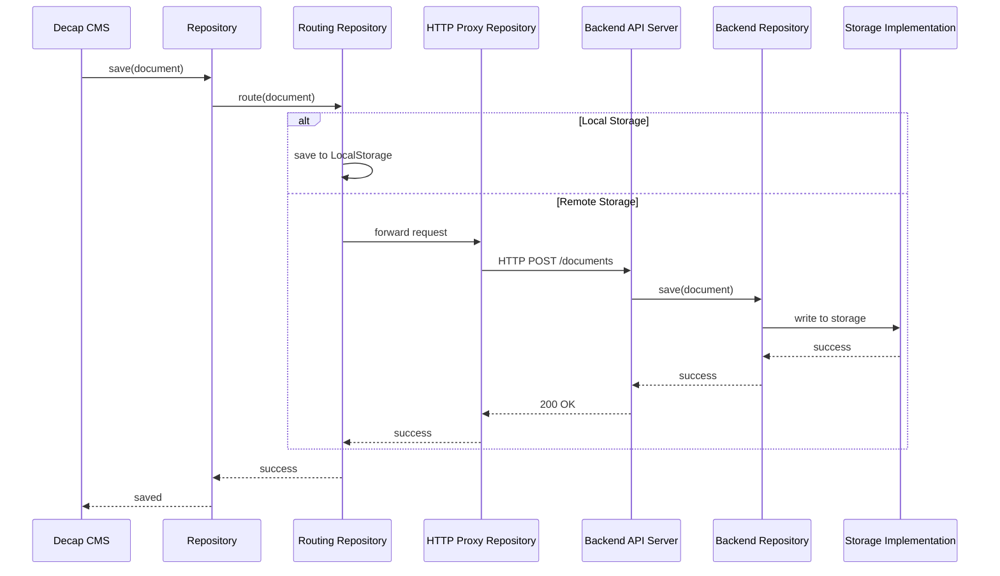
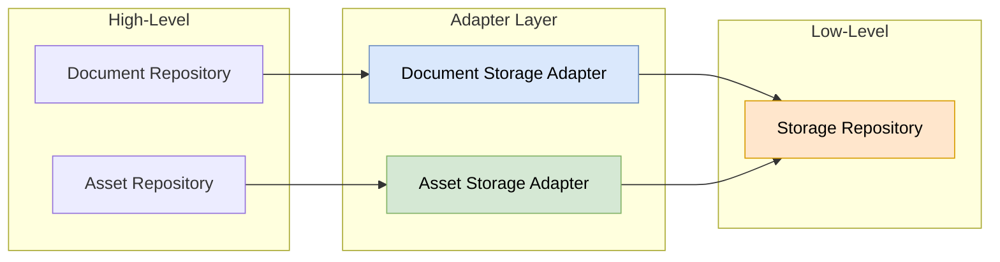

# Laika CMS Repository Architecture

This document explains how repositories work in Laika CMS.

## Overview

Laika CMS uses a **repository pattern** to abstract data storage and retrieval. There are three main
types of repositories:

- **Document Repository** (blue) - Handles structured content/documents (JSON, YAML, etc.)
- **Asset Repository** (green) - Handles binary assets (images, files, etc.)
- **Storage Repository** (orange) - Handles raw storage operations

## Architecture Diagram

```mermaid
flowchart TB
    subgraph Legend
        direction LR
        DocLegend[Document Repository]:::document
        AssetLegend[Asset Repository]:::asset
        StorageLegend[Storage Repository]:::storage
    end

    subgraph Client["Client"]
        DecapCMS[Decap CMS]
        
        subgraph ClientRepos["Client Repositories"]
            AssetRepo[Asset Repository]:::asset
            DocRepo[Document Repository]:::document
        end
        
        subgraph ClientRouting["Routing Layer"]
            AssetRoutingRepo[Routing Repository]:::asset
            DocRoutingRepo[Routing Repository]:::document
        end
        
        subgraph ClientImplementations["Client Repository Implementations"]
            GithubRepo[Github Repository]:::document
            DocStorageAdapter[Document Storage Adapter Repository]:::document
            DocHTTPProxy[Document HTTP Proxy Repository]:::document
            
            AssetStorageAdapter[Asset Storage Adapter Repository]:::asset
            AssetHTTPProxy[Asset HTTP Proxy Repository]:::asset
        end
        
        StorageHTTPProxy[Storage HTTP Proxy Repository]:::storage
        DocStorageAdapter2[Document Storage Adapter Repository]:::document
    end

    subgraph Backend["Backend"]
        subgraph APIServers["API Servers"]
            AssetsAPIServer[Assets API Server]
            DocumentAPIServer[Document API Server]
            StorageAPIServer[Storage API Server]
        end
        
        subgraph BackendRepos["Backend Repositories"]
            BackendDocRepo[Document Repository]:::document
            BackendAssetRepo[Asset Repository]:::asset
            BackendStorageRepo[Storage Repository]:::storage
        end
        
        subgraph BackendRouting["Routing Repositories"]
            DocRoutingBackend[Routing Repository]:::document
            AssetRoutingBackend[Routing Repository]:::asset
            StorageRoutingBackend[Routing Repository]:::storage
        end
        
        subgraph DocumentImplementations["Document Repository Implementations"]
            ContentbaseRepo[documents-contentbase]:::document
            DrizzleRepo[documents-drizzle]:::document
            ObsidianRepo[documents-obsidian]:::document
            JsonapiProxyRepo[documents-jsonapi-proxy]:::document
        end
        
        subgraph AssetImplementations["Asset Repository Implementations"]
            AssetsR2Repo[assets-r2]:::asset
            AssetsContentbaseRepo[assets-contentbase]:::asset
            AssetsObsidianRepo[assets-obsidian]:::asset
            AssetsJsonapiProxyRepo[assets-jsonapi-proxy]:::asset
        end
        
        subgraph StorageImplementations["Storage Repository Implementations"]
            StorageFsRepo[storage-fs]:::storage
            StorageR2Repo[storage-r2]:::storage
            StorageS3Repo[storage-s3]:::storage
            StorageWebdavRepo[storage-webdav]:::storage
            StorageDrizzleRepo[storage-drizzle]:::storage
            StorageJsonapiProxyRepo[storage-jsonapi-proxy]:::storage
            StorageWebRepo[storage-web]:::storage
            StorageWebFsRepo[storage-web-fs]:::storage
        end
    end

    %% Client Flow
    DecapCMS --> AssetRepo
    DecapCMS --> DocRepo
    
    AssetRepo --> AssetRoutingRepo
    DocRepo --> DocRoutingRepo
    
    DocRoutingRepo --> GithubRepo
    DocRoutingRepo --> DocStorageAdapter
    DocRoutingRepo --> DocHTTPProxy
    
    AssetRoutingRepo --> AssetStorageAdapter
    AssetRoutingRepo --> AssetHTTPProxy
    
    DocStorageAdapter --> DocStorageAdapter2
    AssetStorageAdapter --> DocStorageAdapter2
    DocStorageAdapter2 --> StorageHTTPProxy
    
    %% HTTP Proxy to Backend
    DocHTTPProxy --> DocumentAPIServer
    AssetHTTPProxy --> AssetsAPIServer
    StorageHTTPProxy --> StorageAPIServer
    
    %% Backend Flow
    AssetsAPIServer --> BackendAssetRepo
    DocumentAPIServer --> BackendDocRepo
    StorageAPIServer --> BackendStorageRepo
    
    BackendDocRepo --> DocRoutingBackend
    BackendAssetRepo --> AssetRoutingBackend
    BackendStorageRepo --> StorageRoutingBackend
    
    DocRoutingBackend --> ContentbaseRepo
    DocRoutingBackend --> DrizzleRepo
    DocRoutingBackend --> ObsidianRepo
    DocRoutingBackend --> JsonapiProxyRepo
    
    AssetRoutingBackend --> AssetsR2Repo
    AssetRoutingBackend --> AssetsContentbaseRepo
    AssetRoutingBackend --> AssetsObsidianRepo
    AssetRoutingBackend --> AssetsJsonapiProxyRepo
    
    StorageRoutingBackend --> StorageFsRepo
    StorageRoutingBackend --> StorageR2Repo
    StorageRoutingBackend --> StorageS3Repo
    StorageRoutingBackend --> StorageWebdavRepo
    StorageRoutingBackend --> StorageDrizzleRepo
    StorageRoutingBackend --> StorageJsonapiProxyRepo
    StorageRoutingBackend --> StorageWebRepo
    StorageRoutingBackend --> StorageWebFsRepo

    %% Styling
    classDef document fill:#dae8fc,stroke:#6c8ebf,color:#000
    classDef asset fill:#d5e8d4,stroke:#82b366,color:#000
    classDef storage fill:#ffe6cc,stroke:#d79b00,color:#000
```



## How Repositories Work

### Repository Types

1. **Document Repository**
   - Stores and retrieves structured content (pages, posts, settings)
   - Implementations: GitHub, documents-contentbase, documents-drizzle, documents-obsidian,
     documents-jsonapi-proxy

2. **Asset Repository**
   - Manages binary files like images, PDFs, videos
   - Implementations: assets-r2, assets-contentbase, assets-obsidian, assets-jsonapi-proxy

3. **Storage Repository**
   - Low-level storage abstraction for raw data
   - Implementations: storage-fs, storage-r2, storage-s3, storage-webdav, storage-drizzle,
     storage-jsonapi-proxy, storage-web (client-side, read+write, backed by the Web `Storage` API),
     storage-web-fs (client-side, read+write, any File System API directory handle — origin-private
     or user-picked — with per-operation permission and liveness checks)

### Routing Repository Pattern

The **Routing Repository** is a key pattern in Laika CMS that enables:

- **Multi-backend support**: Route requests to different storage backends based on configuration
- **Fallback chains**: Try multiple repositories in sequence
- **Environment-specific storage**: Use LocalStorage in development, cloud storage in production

### Client-Server Architecture



### Storage Adapter Pattern

The **Storage Adapter Repository** bridges between document/asset repositories and raw storage:



This allows:

- Documents and assets to be stored in any storage backend
- Consistent serialization/deserialization
- Unified error handling and retry logic

### HTTP Connection Reuse in Proxy Repositories

The `*-jsonapi-proxy` repositories (storage, documents, assets) send every request through an Effect
`HttpClient` (`effect/unstable/http`) owned by a shared `JsonApiHttpTransport`
(`laikacms/json-api`). Each repository accepts an optional `httpClient` in its constructor options;
when omitted, a process-wide default backed by `globalThis.fetch` is used, which already reuses
connections on Node ≥ 18 (undici's pooled fetch) and on Cloudflare Workers (runtime-managed).

To tune TCP/TLS session reuse on Node, build one client at the composition root and share it across
every proxy repository so they draw from a single connection pool:

```ts
import { httpClientFromFetch } from 'laikacms/json-api';
import { Agent, fetch as undiciFetch } from 'undici';

const dispatcher = new Agent({ keepAliveTimeout: 30_000, connections: 128 });
const httpClient = httpClientFromFetch(
  (input, init) => undiciFetch(input, { ...init, dispatcher }),
);

const storage = new StorageJsonApiProxyRepository({ baseUrl, httpClient });
const documents = new DocumentsJsonApiProxyRepository({ baseUrl, httpClient });
const assets = new AssetsJsonApiProxyRepository({ baseUrl, httpClient });
```

Any `HttpClient.HttpClient` works here — including clients built from `@effect/platform-node`'s
`NodeHttpClient` layers — so retry, tracing, and rate-limiting middleware
(`HttpClient.retryTransient`, `HttpClient.withRateLimiter`, …) can be composed onto the client
without touching the repositories.

`storage-webdav` is the one HTTP adapter that stays on raw `fetch` (injectable via its `fetch`
config option): WebDAV verbs like `PROPFIND` are outside the `HttpMethod` union the Effect client
accepts.

## Key Benefits

1. **Flexibility**: Swap storage backends without changing application code
2. **Testability**: Use LocalStorage or mock repositories in tests
3. **Scalability**: Route to different backends based on content type or size
4. **Offline Support**: LocalStorage repositories enable offline-first editing
5. **Multi-cloud**: Support multiple cloud providers simultaneously
