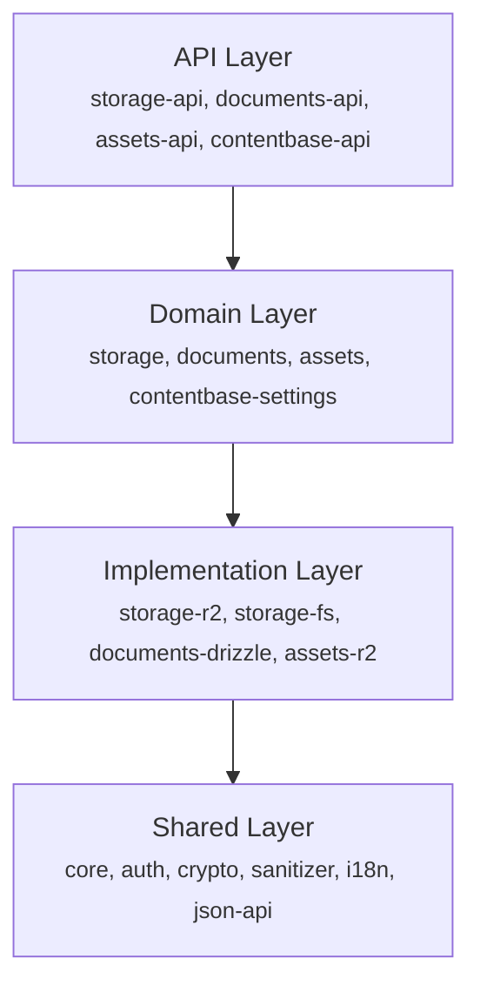

## Quick Links

**Guides**

- [Getting Started](./guides/getting-started) — Installation and basic usage
- [Decap CMS Integration](./guides/decap/) — Using Decap CMS as a frontend
- [Deployment](./guides/deployment) — Production deployment guides
- [Security](./guides/security) — Security best practices

**Concepts**

- [Architecture](./concepts/architecture) — How Laika CMS is structured
- [Repositories](./concepts/repositories) — The repository pattern and its implementations
- [Content Model](./concepts/content-model) — Atoms, folders, the `body` convention, change tracking

**Reference**

- [JSON:API Reference](./reference/json-api/) — Complete API documentation
- [Packages](./reference/packages) — Overview of all packages
- [Glossary](./reference/glossary) — Shared vocabulary (protocol, repository, adapter, version, sync
  token, change feed)

**Contributing**

- [Contributing](./contributing/) — starter templates and the contribution workflow

## Architecture Overview

## Getting Help

- **GitHub Issues** — For bugs and feature requests
- **GitHub Discussions** — For questions and discussions
- **Contributing** — See
  [CONTRIBUTING.md](https://github.com/laikacms/laikacms/blob/develop/CONTRIBUTING.md)

## License

Laika CMS is [MIT licensed](https://github.com/laikacms/laikacms/blob/develop/LICENSE).
