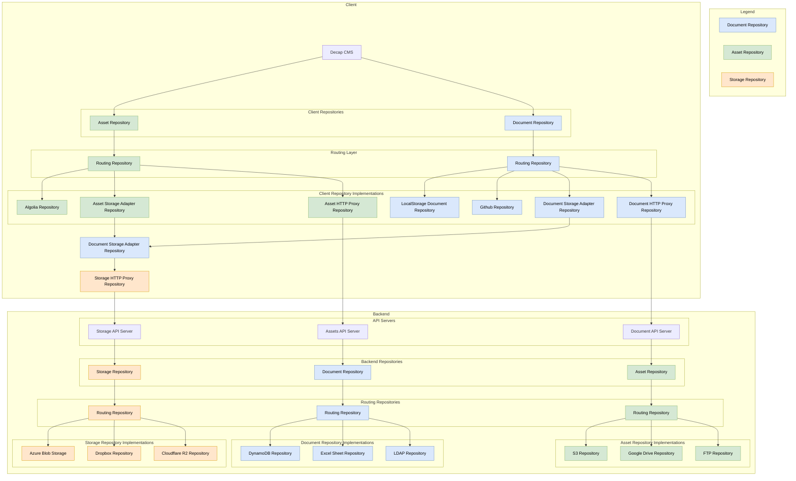
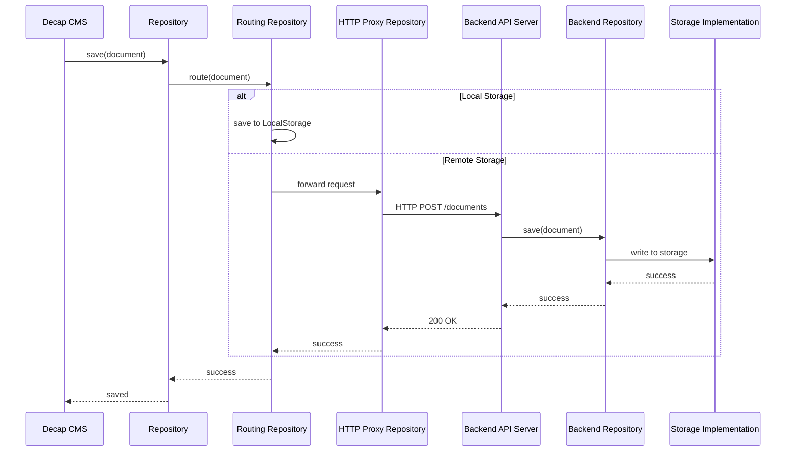
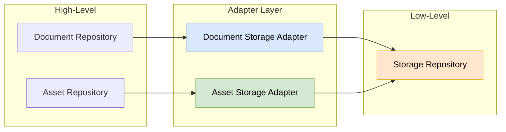

# Laika CMS Repository Architecture

This document explains how repositories work in Laika CMS.

## Overview

Laika CMS uses a **repository pattern** to abstract data storage and retrieval. There are three main
types of repositories:

- **Document Repository** (blue) - Handles structured content/documents (JSON, YAML, etc.)
- **Asset Repository** (green) - Handles binary assets (images, files, etc.)
- **Storage Repository** (orange) - Handles raw storage operations

## Architecture Diagram

## How Repositories Work

### Repository Types

1. **Document Repository**
   - Stores and retrieves structured content (pages, posts, settings)
   - Implementations: LocalStorage, GitHub, DynamoDB, Excel, LDAP

2. **Asset Repository**
   - Manages binary files like images, PDFs, videos
   - Implementations: Algolia (search), S3, Google Drive, FTP

3. **Storage Repository**
   - Low-level storage abstraction for raw data
   - Implementations: Azure Blob, Dropbox, Cloudflare R2

### Routing Repository Pattern

The **Routing Repository** is a key pattern in Laika CMS that enables:

- **Multi-backend support**: Route requests to different storage backends based on configuration
- **Fallback chains**: Try multiple repositories in sequence
- **Environment-specific storage**: Use LocalStorage in development, cloud storage in production

### Client-Server Architecture

### Storage Adapter Pattern

The **Storage Adapter Repository** bridges between document/asset repositories and raw storage:

This allows:

- Documents and assets to be stored in any storage backend
- Consistent serialization/deserialization
- Unified error handling and retry logic

## Key Benefits

1. **Flexibility**: Swap storage backends without changing application code
2. **Testability**: Use LocalStorage or mock repositories in tests
3. **Scalability**: Route to different backends based on content type or size
4. **Offline Support**: LocalStorage repositories enable offline-first editing
5. **Multi-cloud**: Support multiple cloud providers simultaneously
